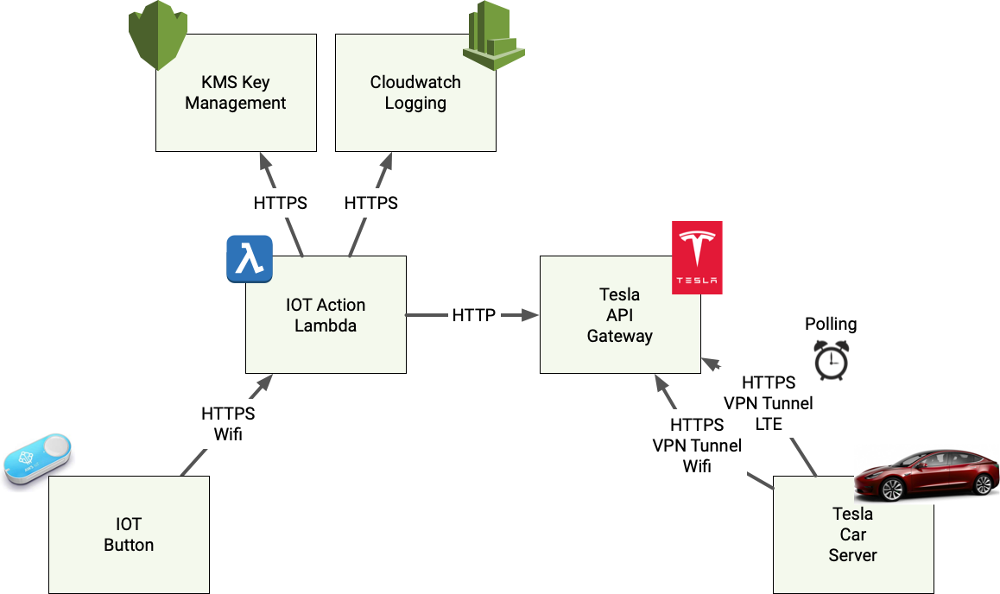

# Tesla IOT Key

Home | [Installation](INSTALLATION.md) | [Development Notes](DEVNOTES.md) | [Licence](LICENSE)

## Overview
Goal of this project is to create some code to support 
using a smart-button to unlock a Tesla parked within a geofence boundary.

## Problem Statement
When I leave for work, I need to unplug my Tesla,
however this cannot be done until the car is awoke and unlocked e.g.
by opening the door, or using the app to unlock and wake the car, 
then walking back to unplug the car.

Further still I only want this button to function while the 
car is in the garage or near the house.  I do not want the 
car to unlock when it is not at home.

## Requirements
- Enable a smart-button to unlock Tesla cars
- Prevent the car from being unlocked when out of eye-sight from my house or garage.
- Be robust enough to function every day without fail
- Be cheap enough to use everyday

## Solution Overview
Use an Amazon IoT button to send a message 
to unlock the Tesla via the Tesla API.

The code inside of this repository contains a basic implementation
of a Lambda function to respond to Amazon IOT Button, and its related 
IoTButtonEvent.

## Licence

This project is licensed under the terms of the MIT license. See the [LICENSE](LICENSE) file.

> This project is in no way affiliated with Tesla Inc. This project is open source under the MIT license, which means you have full access to the source code and can modify it to fit your own needs.

## References
[Tesla API Reference](https://tesla-api.timdorr.com)

[Geographic Coordinate System](https://en.wikipedia.org/wiki/Geographic_coordinate_system)

[Amazon IOT Button Gen.2](https://www.amazon.com/AWS-IoT-Button-2nd-Generation/dp/B01KW6YCIM)

[AWS Lambda Golang Reference](https://docs.aws.amazon.com/lambda/latest/dg/go-programming-model.html)

[AWS Lambda Deployment Package in Go](https://docs.aws.amazon.com/lambda/latest/dg/lambda-go-how-to-create-deployment-package.html)

[IotButtonEvent Sample](https://muzigram.muzigen.net/2018/06/iotbutton-go-firebase-golang-lambda.html)

